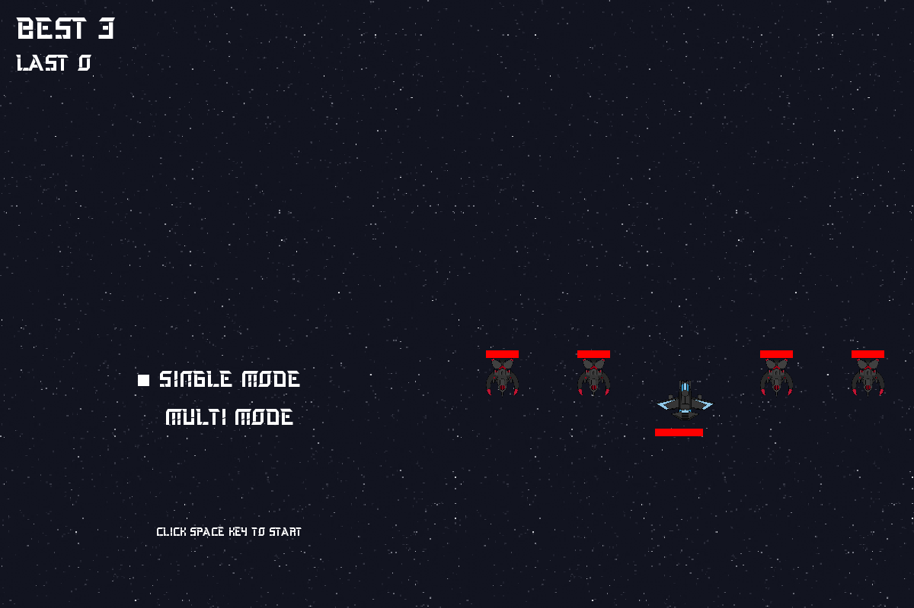
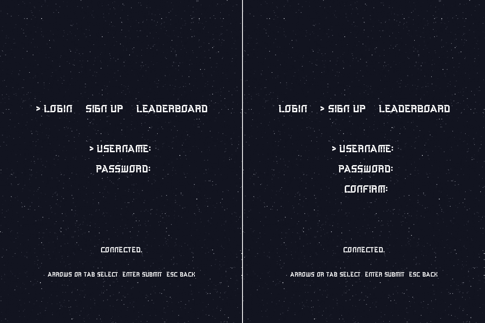
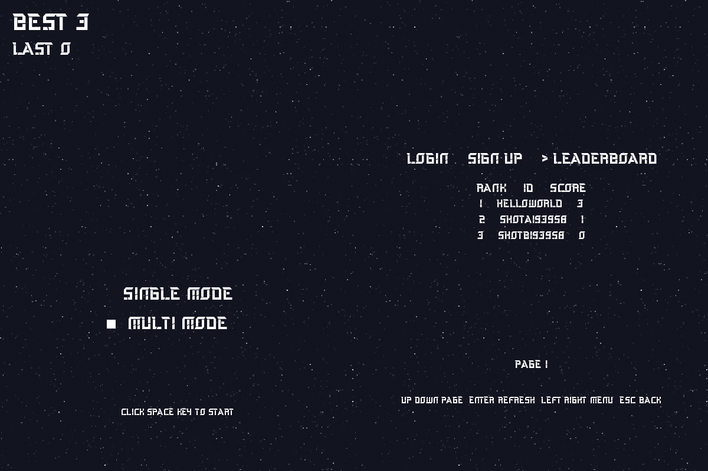

# Multishoot

Windows와 SDL2로 만든 2D 슈팅 게임입니다. 로컬 싱글 플레이와 IOCP TCP 서버 기반 멀티플레이를 지원합니다.

## 프로젝트 구조

루트의 `Multishoot.sln` 하나에 다음 세 프로젝트가 포함됩니다.

| 프로젝트 | 역할 |
| --- | --- |
| `DRLib` | 패킷, 버퍼, 자료구조, IOCP 클라이언트·서버, tinyxml2 공용 정적 라이브러리 |
| `Multishoot` | SDL2 렌더링과 싱글·멀티플레이 클라이언트 |
| `MultishootServer` | 서버 권한형 게임 시뮬레이션 |

```text
.
├─ Multishoot.sln
├─ DRLib/
│  ├─ network/
│  ├─ containers/
│  ├─ math/
│  └─ third_party/
├─ Multishoot/
│  ├─ engine/
│  ├─ entities/
│  ├─ controllers/
│  ├─ scenes/
│  └─ resource/
├─ MultishootServer/
│  └─ game/
├─ tests/
└─ readmeResource/
```

`Multishoot`와 `MultishootServer`는 `DRLib` 프로젝트를 참조하므로 Visual Studio에서 솔루션을 빌드하면 공용 라이브러리가 먼저 빌드됩니다.

## 코드 규칙

- 자체 C++ 파일명은 `lower_snake_case`를 사용하고 헤더 확장자는 `.hpp`로 통일합니다.
- `DRLib`의 자체 타입은 `dr` 네임스페이스에 둡니다.
- 애플리케이션 타입은 전역 네임스페이스를 사용합니다.
- SDL과 `tinyxml2` 같은 외부 코드는 원래 이름과 네임스페이스를 유지합니다.

## 빌드

- Windows 10 SDK
- MSVC platform toolset `v145`
- C++ `stdcpplatest`
- Visual Studio 18 이상

Visual Studio에서 `Multishoot.sln`을 열고 `Debug | x64`로 빌드합니다.

Developer PowerShell에서는 다음 명령을 사용할 수 있습니다.

```powershell
msbuild .\Multishoot.sln /m /t:Build /p:Configuration=Debug /p:Platform=x64
```

결과물은 `x64\Debug`에 생성됩니다.

## 실행

멀티플레이는 서버를 먼저 실행합니다.

```powershell
& '.\x64\Debug\MultishootServer.exe'
```

클라이언트는 리소스 상대 경로를 위해 프로젝트 폴더에서 실행합니다.

```powershell
Push-Location '.\Multishoot'
& '..\x64\Debug\Multishoot.exe'
Pop-Location
```

서버와 클라이언트는 기본적으로 `127.0.0.1:3000`을 사용합니다.

## 조작법

| 화면 | 입력 | 동작 |
| --- | --- | --- |
| 로비 | 위/아래 방향키 | 싱글·멀티 모드 선택 |
| 로비 | Space | 선택한 모드 시작 |
| 게임 | 방향키 | 플레이어 이동 |
| 게임 | Space | 발사 |

## 테스트

`Debug | x64` 빌드 후 네트워크 스모크 테스트를 실행합니다.

```powershell
powershell.exe -NoProfile -ExecutionPolicy Bypass -File .\tests\NetworkSmoke.ps1
```

테스트는 비정상 크기 프레임 처리, 플레이어 ID 위조 거부, 분할 TCP 프레임 재조립을 검사합니다.

## 화면







## 제약 사항

- Windows IOCP와 Winsock2를 사용하는 Windows 전용 프로젝트입니다.
- 게임 프로토콜은 현재 C++ 구조체 ABI에 의존합니다.
- 암호화, 인증, 자동 재접속은 지원하지 않습니다.
