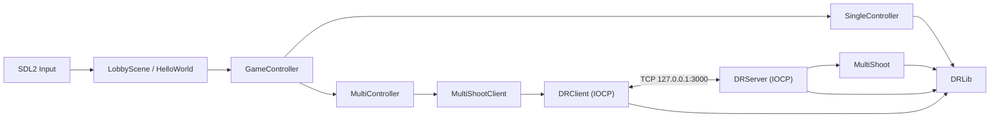

# MultiShoot

MultiShoot는 Windows와 SDL2로 구현한 인베이더 스타일의 2D 슈팅 게임입니다. 하나의 클라이언트 실행 파일에서 로컬 싱글 모드와 TCP 서버 기반 멀티 모드를 선택할 수 있습니다.

현재 리포지토리는 다음 세 프로젝트로 구성됩니다.

- `MultiShoot`: SDL2 렌더링, 입력, 씬, 게임 오브젝트와 싱글·멀티 클라이언트 로직
- `DashRobot`: IOCP 네트워크 서버와 서버 권한형 멀티플레이 시뮬레이션
- `DRLib`: 양쪽 프로젝트가 공유하는 네트워크 자료구조, 패킷 프레이밍, 벡터와 충돌 계산

## 주요 기능

- 방향키 이동과 연속 발사 기능을 제공하는 2D 슈팅 게임
- 서버 없이 실행되는 싱글 모드
- 여러 클라이언트가 같은 월드에 접속하는 멀티 모드
- 서버 권한형 위치 갱신, 투사체·몬스터 생성과 충돌 판정
- IOCP 기반 비동기 TCP 송수신
- TCP 분할 수신과 여러 프레임의 연속 수신 처리
- 로컬 XML 파일을 이용한 최근 점수와 최고 점수 저장
- 비트맵 이미지와 TrueType 글꼴을 사용하는 SDL2 렌더링

## 전체 구조



`GameController`가 싱글 모드와 멀티 모드의 차이를 감춥니다. `HelloWorld` 씬은 어느 모드에서도 동일한 응답 패킷을 소비하며 화면을 갱신합니다. 싱글 모드는 `SingleController`가 응답을 로컬에서 생성하고, 멀티 모드는 `MultiController`가 서버 응답을 전달합니다.

## 리포지토리 트리

```text
.
├─ DRLib/
│  ├─ DRLib.vcxproj
│  ├─ DRPacket.*
│  ├─ RingBuffer.*
│  ├─ DRQueue.h
│  ├─ DRStack.h
│  ├─ DRObjectPool.h
│  ├─ Vector.*
│  └─ Rect.*
├─ MultiShootClient/
│  ├─ MultiShoot.sln
│  └─ MultiShoot/
│     ├─ main.cpp
│     ├─ DRClient.*
│     ├─ MultiShootClient.*
│     ├─ GameController.*
│     ├─ SingleController.*
│     ├─ MultiController.*
│     ├─ LobbyScene.* / HelloWorld.*
│     ├─ GameManager.* / Scene.* / Object.*
│     ├─ Graphics.* / Input.* / Text.*
│     ├─ Player.* / Enemy.* / Bullet.*
│     ├─ PlayerPref.* / PlayerPref.xml
│     ├─ tinyxml2.*
│     ├─ resource/
│     ├─ SDL2/
│     └─ SDL2_ttf/
├─ MultiShoot_server/
│  ├─ DashRobot.sln
│  └─ DashRobot/
│     ├─ main.cpp
│     ├─ DRServer.*
│     ├─ MultiShoot.*
│     ├─ MarkableReference.*
│     └─ stdafx.*
├─ tests/
│  └─ NetworkSmoke.ps1
├─ readmeResource/
│  └─ image_1.png / image_2.png / image_3.png
└─ README.md
```

`MultiShoot.sln`과 `DashRobot.sln`은 각각 애플리케이션 프로젝트와 루트의 `DRLib.vcxproj`를 함께 참조합니다. 따라서 어느 솔루션을 빌드해도 `DRLib`가 먼저 정적 라이브러리로 빌드된 후 해당 실행 파일에 링크됩니다.

## DRLib

`DRLib`는 클라이언트와 서버에서 중복되던 코드를 한곳으로 모은 Windows용 정적 라이브러리입니다.

| 구성 요소 | 역할 |
| --- | --- |
| `DRPacket` | 고정 크기 버퍼에 TCP 프레임 헤더와 본문을 구성하고 해석합니다. |
| `RingBuffer` | TCP 스트림에서 잘려 들어오거나 연속으로 들어온 프레임을 누적하고 순서대로 꺼냅니다. 내부 접근은 `CRITICAL_SECTION`으로 보호합니다. |
| `DRQueue<T>` | 송신·수신 작업 전달에 사용하는 다중 생산자·단일 소비자 큐입니다. 템플릿이므로 헤더에 구현되어 있습니다. |
| `DRStack<T>` | Windows `SLIST` API를 사용하는 lock-free 스택입니다. |
| `DRObjectPool<T>` | `DRStack<T*>`에 반환된 객체를 보관해 패킷과 OVERLAPPED 작업 객체를 재사용합니다. |
| `Tvdr::Vector` | 위치, 방향, 크기 계산에 사용하는 2차원 벡터입니다. |
| `Tvdr::Rect` | 클라이언트와 서버가 동일하게 사용하는 AABB 겹침 판정입니다. |

`DRQueue`, `DRStack`, `DRObjectPool`은 템플릿이기 때문에 별도 `.cpp`가 없습니다. `DRPacket`, `RingBuffer`, `Vector`, `Rect`의 구현만 `DRLib.lib`에 포함됩니다.

## 클라이언트 구조

### 시작점과 씬

- `main.cpp`: 600×800 크기의 `Terminvader` 창을 만들고 `LobbyScene`으로 게임 루프를 시작합니다.
- `LobbyScene`: 싱글·멀티 모드 선택, 최근 점수와 최고 점수 표시를 담당합니다.
- `HelloWorld`: 게임 화면을 구성하고 컨트롤러가 생성한 패킷을 소비해 플레이어, 적, 총알의 화면 상태를 반영합니다.

### 모드 추상화

`GameController`는 `ChangeDir`, `Shoot`, `Pop`이라는 공통 경계를 제공합니다.

- `SingleController`: 플레이어·몬스터·총알 목록을 직접 관리하고 이동, 스폰, 충돌과 점수를 로컬에서 계산합니다. 결과를 서버 응답과 같은 패킷 형태로 `_resQ`에 넣습니다.
- `MultiController`: `MultiShootClient`를 `127.0.0.1:3000`에 연결하고 입력 요청을 서버로 전송합니다. 네트워크에서 받은 응답은 같은 `_resQ`로 전달합니다.

이 구조 덕분에 `HelloWorld`는 현재 모드가 로컬 시뮬레이션인지 원격 서버인지 구분하지 않고 같은 `PacketType` 분기만 처리합니다.

### 클라이언트 네트워크 계층

`DRClient`는 Winsock2와 IOCP를 감싼 추상 기반 클래스입니다. 연결 후 다음 스레드를 실행합니다.

- IO 스레드 2개: OVERLAPPED 수신·송신 완료와 부분 송신 재제출을 처리합니다.
- send 스레드 1개: `sendQ`에서 프레임을 꺼내 `WSASend`를 제출합니다.
- callback 스레드 1개: `OnUpdate`, `OnSend`, `OnRecv`, `OnDisconnected`를 호출합니다.

수신 바이트는 `RingBuffer`에 누적됩니다. 완전한 `DRPacket` 프레임이 만들어지면 callback 큐로 전달되고, `MultiShootClient::OnRecv`가 `GameController::CreatePacket`으로 본문을 구체적인 게임 패킷 객체로 복사합니다. 이후 `MultiController`가 이 객체를 씬에서 사용하는 응답 큐로 옮깁니다.

`end()`는 새 작업을 중단하고 소켓을 닫은 뒤, 제출된 IO가 모두 완료될 때까지 기다리고 각 스레드와 Winsock 자원을 순서대로 정리합니다. 멀티 모드를 시작할 때 서버 연결에 실패하면 `MultiController::Work()`가 false가 되어 게임 씬은 로비로 돌아갑니다.

### 렌더링과 오브젝트 계층

| 구성 요소 | 역할 |
| --- | --- |
| `GameManager` | SDL 이벤트, 입력 갱신, 씬 업데이트, 렌더링, 지연 해제를 포함하는 메인 루프를 관리합니다. |
| `Scene` | 자식 `Object` 전체를 재귀적으로 업데이트하고 해제합니다. |
| `Object` | 부모·자식 관계, 위치, 크기, 활성 상태와 지연 해제 상태를 가집니다. |
| `GameObject` | BMP 파일을 SDL 텍스처로 읽고 위치·스케일·앵커에 따라 렌더링합니다. |
| `Graphics` | SDL 창과 렌더러의 생성, 프레임 지우기와 표시를 담당합니다. |
| `Input` | SDL 스캔코드별 현재·이전 키 상태를 저장해 눌림, 유지, 뗌을 구분합니다. |
| `Text` | SDL_ttf로 글꼴을 열고 문자열을 텍스처로 변환합니다. |
| `PlayerPref` | `tinyxml2`를 사용해 정수·실수·문자열 값을 `PlayerPref.xml`에 저장합니다. |
| `TVDR.hpp` | 클라이언트 엔진 헤더를 한 번에 포함하기 위한 umbrella header입니다. |

`Player`, `Enemy`, `Bullet`은 `GameObject`를 상속합니다. 멀티 모드에서 물리와 충돌 결과는 서버가 결정하지만, 클라이언트 객체는 수신된 방향과 생성 위치를 기준으로 프레임별 화면 이동을 수행합니다. 비활성화된 적과 총알은 `HelloWorld`에서 다시 사용됩니다.

### 리소스와 저장 데이터

- `resource/background.bmp`: 로비와 게임 배경
- `resource/player.bmp`: 플레이어 이미지
- `resource/enemy.bmp`: 몬스터 이미지
- `resource/1.bmp`: 총알 및 선택 표시 이미지
- `resource/Plaguard-ZVnjx.ttf`: 화면 텍스트 글꼴
- `PlayerPref.xml`: `score`, `bestscore`, `id` 등의 로컬 값

이미지와 글꼴은 실행 시 `resource/<파일명>`으로, 설정은 `PlayerPref.xml`로 접근합니다. 따라서 클라이언트의 현재 작업 디렉터리는 `MultiShootClient/MultiShoot`이어야 합니다.

`Packet.*`은 길이 4바이트와 문자열 본문을 조합하는 별도 유틸리티입니다. 현재 IOCP 게임 통신은 이 클래스가 아니라 `DRLib/DRPacket`을 사용합니다.

## 서버 구조

### `main.cpp`

서버 진입점은 다음 순서로 동작합니다.

1. 기본 포트 `3000` 또는 첫 번째 명령행 인수의 포트를 선택합니다.
2. 논리 프로세서 수를 조회해 IOCP 작업 스레드 수로 전달합니다.
3. `MultiShoot::init`과 `start`를 호출합니다.
4. 표준 입력에서 한 줄을 받을 때까지 실행합니다.
5. 입력을 받으면 `end`를 호출해 스레드, 소켓과 Winsock을 정리합니다.

클라이언트의 접속 주소는 현재 `127.0.0.1:3000`으로 고정되어 있습니다. 서버를 다른 포트로 실행하면 클라이언트 코드의 주소도 함께 변경해야 합니다.

### `DRServer`

`DRServer`는 게임 규칙과 분리된 IOCP TCP 서버 기반 클래스입니다.

- accept 스레드 1개: 연결을 수락하고 소켓을 IOCP에 연결합니다.
- IO 스레드 N개: N은 서버 시작 시 전달된 논리 프로세서 수이며 `WSARecv`와 `WSASend` 완료를 처리합니다.
- send 스레드 1개: `sendQ`의 프레임을 OVERLAPPED 송신으로 제출합니다.
- callback 스레드 1개: accept, receive, send, leave 이벤트를 게임 콜백으로 직렬화하고 `OnUpdate(dt)`를 실행합니다.

클라이언트별 상태는 소켓, 주소, 수신 링 버퍼, 참조 수와 종료 상태를 가집니다. 비동기 작업과 콜백 큐가 같은 연결 객체를 공유하므로 원자적 참조 수를 사용해 마지막 작업이 끝난 뒤 객체를 삭제합니다.

### `MultiShoot`

`MultiShoot`은 `DRServer`를 상속한 멀티플레이 게임 서버입니다.

- 접속한 플레이어에게 ID를 부여하고 현재 플레이어·몬스터·총알 상태를 전송합니다.
- 새 플레이어의 생성을 모든 접속자에게 방송합니다.
- 방향 변경 요청과 발사 요청의 플레이어 ID가 실제 요청 소켓의 플레이어인지 확인합니다.
- 플레이어, 몬스터와 총알의 위치를 서버 시간 간격으로 갱신합니다.
- 3초마다 몬스터 5개를 생성합니다.
- `Tvdr::Rect`로 총알-몬스터 및 플레이어-몬스터 충돌을 판정합니다.
- 피격, 처치와 게임 종료 결과를 응답 패킷으로 방송하거나 해당 플레이어에게 전송합니다.

`MarkableReference`는 포인터 하위 비트에 표식을 저장하는 보조 템플릿이지만 현재 실행 경로에서는 사용되지 않습니다. `libmysql.dll`과 Release x64의 MySQL include/library 경로도 남아 있으나 현재 서버 소스에는 데이터베이스 호출이 없습니다.

## 실행 흐름

### 싱글 모드

1. `LobbyScene`에서 싱글 모드를 선택합니다.
2. `HelloWorld`가 `SingleController`를 생성합니다.
3. 컨트롤러가 로그인과 플레이어 생성 응답을 로컬 큐에 넣습니다.
4. 입력에 따라 방향 변경과 발사 응답을 생성합니다.
5. 몬스터 이동과 충돌을 로컬에서 계산합니다.
6. 게임 종료 시 점수를 `PlayerPref.xml`에 반영하고 로비로 돌아갑니다.

### 멀티 모드

1. 서버가 먼저 `0.0.0.0:3000`에서 대기합니다.
2. `MultiController`가 `MultiShootClient`와 `DRClient`를 통해 서버에 연결합니다.
3. 서버가 로그인 ID와 현재 월드 스냅샷을 전송합니다.
4. 클라이언트 입력은 `CHANGE_DIR_REQ` 또는 `SHOOT_REQ`가 됩니다.
5. 서버가 요청 소유권을 검사하고 시뮬레이션 상태를 변경합니다.
6. 서버 응답이 모든 클라이언트의 `HelloWorld`에 전달되어 화면 상태를 갱신합니다.

## 네트워크 프레임

TCP 메시지는 `DRPacket::Header`와 본문으로 구성됩니다. 현재 MSVC 빌드에서 헤더 크기는 구조체 정렬을 포함해 8바이트입니다.

| 오프셋 | 필드 | 크기 | 의미 |
| ---: | --- | ---: | --- |
| 0 | `code` | 1바이트 | 고정값 `12` |
| 1 | padding | 3바이트 | `int` 정렬을 위한 구조체 패딩 |
| 4 | `size` | 4바이트 | 뒤따르는 본문의 바이트 수 |
| 8 | body | `size`바이트 | 게임 패킷 구조체 |

전체 버퍼는 512바이트이고 현재 최대 본문 크기는 504바이트입니다. 수신 측은 다음 조건을 검사합니다.

- 코드가 `12`인지 확인
- 본문 크기가 `0..504`인지 확인
- 헤더 또는 본문이 덜 도착했으면 링 버퍼에서 다음 수신을 기다림
- 완성된 프레임만 콜백 큐로 전달
- 게임 패킷 종류별로 본문 크기가 정확히 해당 구조체 크기인지 확인

### 게임 패킷

| 값 | 패킷 | 방향 | 주요 데이터 |
| ---: | --- | --- | --- |
| 0 | `CHANGE_DIR_REQ` | 클라이언트 → 서버 | 방향, 플레이어 ID |
| 1 | `SHOOT_REQ` | 클라이언트 → 서버 | 플레이어 ID |
| 2 | `LOGIN_RES` | 서버 → 클라이언트 | 할당된 플레이어 ID |
| 3 | `PLAYER_SPAWN_RES` | 서버 → 클라이언트 | 플레이어 ID, 방향, 위치, HP |
| 4 | `CHANGE_DIR_RES` | 서버 → 클라이언트 | 방향, 서버 위치, 플레이어 ID |
| 5 | `SHOOT_RES` | 서버 → 클라이언트 | 총알 위치와 ID |
| 6 | `MONSTER_SPAWN_RES` | 서버 → 클라이언트 | 몬스터 위치, ID, HP |
| 7 | `MONSTER_HIT_RES` | 서버 → 클라이언트 | 몬스터 ID, 총알 ID, 남은 HP |
| 8 | `PLAYER_HIT_RES` | 서버 → 클라이언트 | 플레이어 ID, 몬스터 ID, 남은 HP |
| 9 | `GAME_END_RES` | 서버 → 클라이언트 | 플레이어 ID, 점수, 최고 점수 |

프로토콜은 현재 C++ 구조체 메모리를 그대로 전송합니다. 별도 직렬화, 바이트 순서 변환, 버전 필드가 없으므로 클라이언트와 서버는 같은 구조체 정의, 정렬 규칙, 정수 크기와 엔디언을 사용해야 합니다. `PacketType`과 게임 패킷 구조체는 현재 클라이언트의 `GameController.h`와 서버의 `MultiShoot.h`에 각각 정의되어 있으므로 프로토콜 변경 시 두 파일을 함께 수정해야 합니다.

## 빌드 환경

현재 프로젝트 설정의 기준은 다음과 같습니다.

- Windows 10 SDK
- MSVC platform toolset `v145`
- C++ language standard `stdcpplatest`
- Visual Studio 또는 Developer PowerShell의 MSBuild
- 클라이언트: SDL2, SDL2_ttf, Winsock2, Shell32
- 서버: Winsock2와 Windows IOCP

SDL2와 SDL2_ttf의 헤더, 라이브러리와 DLL은 `MultiShootClient/MultiShoot` 아래에 포함되어 있습니다. `tinyxml2` 소스도 클라이언트 프로젝트에서 직접 빌드합니다.

### Visual Studio

1. `MultiShoot_server/DashRobot.sln`을 열고 `Debug | x64`로 빌드합니다.
2. `MultiShootClient/MultiShoot.sln`을 열고 `Debug | x64`로 빌드합니다.
3. 각 솔루션에서 `DRLib`가 먼저 빌드되는지 확인합니다.

### 명령행

Visual Studio Developer PowerShell에서 리포지토리 루트를 기준으로 실행합니다.

```powershell
msbuild .\MultiShoot_server\DashRobot.sln /m /t:Build /p:Configuration=Debug /p:Platform=x64
msbuild .\MultiShootClient\MultiShoot.sln /m /t:Build /p:Configuration=Debug /p:Platform=x64
```

주요 빌드 결과는 다음 위치에 생성됩니다.

- 서버: `MultiShoot_server/x64/Debug/DashRobot.exe`
- 클라이언트: `MultiShootClient/x64/Debug/MultiShoot.exe`
- 공유 라이브러리: 각 솔루션의 `x64/Debug/DRLib.lib`

## 실행 방법

멀티 모드는 서버를 먼저 실행합니다.

```powershell
# 리포지토리 루트에서 서버 시작
& '.\MultiShoot_server\x64\Debug\DashRobot.exe'
```

서버는 기본 포트 3000을 사용합니다. 종료하려면 서버 콘솔에서 아무 문자열이나 입력한 뒤 Enter를 누릅니다.

클라이언트는 리소스와 `PlayerPref.xml`의 상대 경로 때문에 프로젝트 디렉터리를 작업 디렉터리로 사용해야 합니다.

```powershell
Push-Location '.\MultiShootClient\MultiShoot'
& '..\x64\Debug\MultiShoot.exe'
Pop-Location
```

여러 터미널에서 같은 클라이언트 명령을 실행하면 멀티 모드에서 여러 플레이어를 확인할 수 있습니다.

### 조작법

| 화면 | 입력 | 동작 |
| --- | --- | --- |
| 로비 | 위/아래 방향키 | 싱글·멀티 모드 변경 |
| 로비 | Space | 선택한 모드 시작 |
| 게임 | 방향키 | 플레이어 이동 |
| 게임 | Space | 발사, 0.2초 쿨다운 |
| 전체 | 창 닫기 | 클라이언트 종료 |

## 테스트

`tests/NetworkSmoke.ps1`은 빌드된 Debug x64 서버를 직접 실행해 네트워크 경계를 검사합니다.

```powershell
powershell.exe -NoProfile -ExecutionPolicy Bypass -File .\tests\NetworkSmoke.ps1
```

검사 항목은 다음과 같습니다.

- 최대 크기를 넘는 프레임을 보낸 연결이 종료되고 서버는 계속 실행되는지
- 다른 플레이어 ID를 사용한 발사 요청이 거부되는지
- 하나의 프레임을 여러 TCP 조각으로 전송해도 정상적으로 재조립되는지

테스트의 기본 서버 경로는 `MultiShoot_server/x64/Debug/DashRobot.exe`이므로 서버 솔루션을 먼저 `Debug | x64`로 빌드해야 합니다.

## 화면

### 로비와 싱글 모드


싱글 모드는 서버 없이 실행되며 마지막 점수와 최고 점수를 `PlayerPref.xml`에 저장합니다.

### 멀티 모드


## 현재 제약 사항

- Windows IOCP, Winsock2, `SLIST`를 사용하므로 Windows 전용입니다.
- 멀티 클라이언트의 서버 주소와 포트는 `127.0.0.1:3000`으로 하드코딩되어 있습니다.
- 게임 프로토콜이 원시 C++ 구조체 ABI에 의존하므로 다른 컴파일러·플랫폼과 바로 호환되지 않습니다.
- 프로토콜 구조체 정의가 클라이언트와 서버에 각각 존재합니다.
- 통신 계층에는 암호화, 인증, 재접속 기능이 없습니다.
- 서버 점수는 메모리에만 존재하며 서버 재시작 시 초기화됩니다.
- Release x64 서버 프로젝트에는 로컬 MySQL 설치 경로가 남아 있지만 현재 데이터베이스 기능은 사용하지 않습니다.
